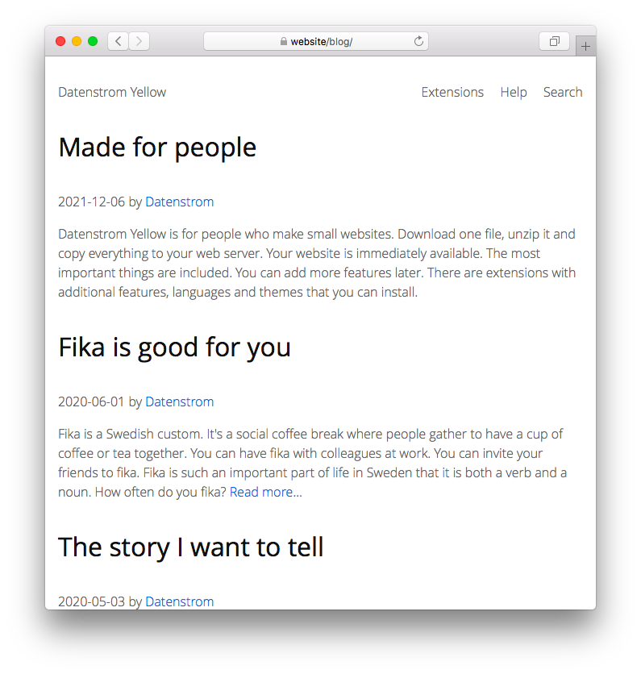

<a href="README-de.md">Deutsch</a> &nbsp; <a href="README.md">English</a> &nbsp; <a href="README-sv.md">Svenska</a>

# Blog 0.9.1

Blogg för din webbplats

## Hur man installerar ett tillägg

[Ladda ner ZIP-filen](https://github.com/annaesvensson/yellow-blog/archive/refs/heads/main.zip) och kopiera den till din `system/extensions` mapp. [Läs mer om tillägg](https://github.com/annaesvensson/yellow-update/tree/main/README-sv.md).

## Hur man använder en blogg

Bloggen finns tillgänglig på din webbplats som `http://website/blog/`. För att skapa en ny bloggsida, lägg till en ny fil i blogg-mappen. Ställ in `Published` och andra [sidinställningar](https://github.com/annaesvensson/yellow-core/tree/main/README-sv.md#inställningar-page) högst upp på en sida. Datum ska skrivas i formatet ÅÅÅÅ-MM-DD. Publiceringsdatum kommer att användas för att sortera bloggsidor. Använd `Tag` för att gruppera liknande sidor. Du kan använda `[--more--]` för att lägga till en sidbrytning på önskad plats.

## Hur man redigerar en blogg

Om du vill redigera bloggsidor i en [webbläsare](https://github.com/annaesvensson/yellow-edit/tree/main/README-sv.md) kan du göra detta på din webbplats på `http://website/edit/blog/`. Om du vill redigera bloggsidor på din [dator](https://github.com/annaesvensson/yellow-core/tree/main/README-sv.md), ta en titt på `content/2-blog` mappen. Här är några tips. Högst upp på en sida kan du ändra `Title` och andra [sidinställningar](https://github.com/annaesvensson/yellow-core/tree/main/README-sv.md#inställningar-page). Nedan kan du ändra text och bilder. [Läs mer om textformatering](https://datenstrom.se/sv/yellow/help/how-to-change-the-content).

## Hur man visar blogginformation

Du kan använda förkortningar för att visa information om bloggen:

`[blogauthors]` för en lista över författare  
`[blogtags]` för en lista med taggar  
`[blogyears]` för en lista med år  
`[blogmonths]` för en lista med månader  
`[blogpages]` för en lista över sidor, publicerad ordning  

Följande argument är tillgängliga:

`StartLocation` = plats för bloggstartsida, `auto` för automatisk detektering  
`ShortcutEntries` = antal inlägg att visa per förkortning, 0 för obegränsad  
`FilterTag` = visa sidor med en specifik tagg, endast `[blogpages]`  

## Exempel

Innehållsfil för bloggen:

    ---
    Title: Blogg exempelsida
    Published: 2020-04-07
    Author: Datenstrom
    Layout: blog
    Tag: Exempel
    ---
    Detta är en exempelsida.

    Lorem ipsum dolor sit amet, consectetur adipisicing elit, sed do eiusmod tempor incididunt ut 
    labore et dolore magna pizza. Ut enim ad minim veniam, quis nostrud exercitation ullamco laboris 
    nisi ut aliquip ex ea commodo consequat. Duis aute irure dolor in reprehenderit in voluptate velit 
    esse cillum dolore eu fugiat nulla pariatur. Excepteur sint occaecat cupidatat non proident, sunt 
    in culpa qui officia deserunt mollit anim id est laborum.

Innehållsfil för bloggen, med sidbrytning:

    ---
    Title: Fika är bra för dig
    Published: 2020-06-01
    Author: Datenstrom
    Layout: blog
    Tag: Exempel, Kaffe
    ---
    Fika är en svensk sed. Det är en social kaffepaus där människor
    samlas för att ta en kopp kaffe eller te tillsammans. Du kan ha fika 
    med kollegor på jobbet. Du kan bjuda in dina vänner till fika. Fika 
    är en så viktig del av vardagen i Sverige att det är både ett verb 
    och ett substantiv. Hur ofta fikar du? [--more--]

    [youtube SUpY1BT9Xf4]

Innehållsfil med blogginformation:

    ---
    Title: Översikt
    ---
    ## Sidor

    [blogpages]

    ## Taggar

    [blogtags]

Visa lista med sidor, olika antal inlägg:

    [blogpages /blog/ 0]
    [blogpages /blog/ 3]
    [blogpages /blog/ 10]

Visa lista med sidor, med en specifik tagg:

    [blogpages /blog/ 0 kaffe]
    [blogpages /blog/ 0 mjölk]
    [blogpages /blog/ 0 exempel]

Visa länkar till bloggen:

    [Se alla sidor](/blog/)
    [Se sidor för 2020](/blog/published:2020/)
    [Se sidor av Datenstrom](/blog/author:datenstrom/)
    [Se sidor om kaffe](/blog/tag:kaffe/)
    [Se sidor med exempel](/blog/tag:exempel/)

Konfigurera bloggaddres i inställningar, URL identifieras automatiskt:

    BlogStartLocation: auto
    BlogNewLocation: @title

Konfigurera bloggaddres i inställningar, URL med publiceringsdatum:

    BlogStartLocation: /blog/
    BlogNewLocation: /blog/@date/@title

Konfigurera bloggaddres i inställningar, URL med undermapp för varje år:

    BlogStartLocation: /blog/
    BlogNewLocation: /blog/@year/@title

## Inställningar

Följande inställningar kan konfigureras i filen `system/extensions/yellow-system.ini`:

`BlogStartLocation` = plats för bloggstartsida, `auto` för automatisk detektering  
`BlogNewLocation` = plats för nya bloggsidor, [stödda platshållare](#inställningar-placeholders)  
`BlogShortcutEntries` = antal inlägg att visa per förkortning, 0 för obegränsad  
`BlogPaginationLimit` = antal inlägg att visa per sida, 0 för obegränsad  

Följande platshållare för nya bloggsidor stöds:

`@title` = namn på sidan  
`@author` = sedans författare  
`@tag` = taggar för kategorisering av sidan  
`@timestamp` = sidans publiceringsdatum som tidsstämpel  
`@datetime` = sidans publiceringsdatum, ÅÅÅÅ-MM-DD TT:MM:SS format  
`@date` = sidans publiceringsdatum, ÅÅÅÅ-MM-DD format  
`@year` = sidans publiceringsår  
`@month` = sidans publiceringsmånad  
`@day` = sidans publiceringsdag  

Följande filer kan anpassas:

`content/shared/page-new-blog.md` = innehållsfil för ny bloggsida  
`system/layouts/blog.html` = layoutfil för enskild bloggsida  
`system/layouts/blog-start.html` = layoutfil för bloggstartsida  

## Utvecklare

Anna Svensson. [Få hjälp](https://datenstrom.se/sv/yellow/help/).
